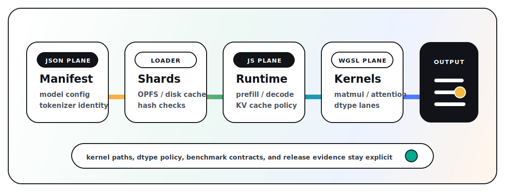

# doppler-gpu

WebGPU inference runtime for browser, Node, Bun, CLI, and local server use.
Doppler runs JavaScript orchestration over WGSL kernels and loads models from
RDRR manifests.

**[Try the live demo](https://d4da.com/doppler)** | **[npm](https://www.npmjs.com/package/doppler-gpu)** | **[docs](https://github.com/clocksmith/doppler/blob/main/docs/INDEX.md)**

Broader model status and compare evidence live in the support and release
matrices. See the
[benchmark methodology](https://github.com/clocksmith/doppler/blob/main/docs/benchmark-methodology.md)
for the receipt contract and disclosure rules.

## What it is

- A WebGPU inference engine written in JavaScript and WGSL.
- A shared browser, Node, Bun, CLI, and OpenAI-compatible server surface.
- An RDRR model loader for sharded weights, manifest-owned config, and tokenizer
  metadata.
- A runtime that keeps kernel paths, dtype policy, and benchmark contracts
  visible in JSON, JavaScript, and WGSL.

## Goals

Doppler's mainline work is organized around three concrete surfaces:

1. Make local WebGPU inference a real product surface across the hosted browser
   demo, `npx doppler-gpu`, root API, CLI, Node/Bun, and OpenAI-compatible
   localhost server.
2. Own the model artifact and runtime contract through RDRR manifests, hosted
   registry IDs, explicit runtime config, tokenizer/shard identity, and support
   matrices.
3. Make correctness and performance evidence-backed through release receipts,
   benchmark artifacts, command parity, explicit kernel paths, and fail-closed
   unsupported paths.

See
[docs/goals.md](https://github.com/clocksmith/doppler/blob/main/docs/goals.md)
for the product and technical contract behind those goals. The current
completion gate is `src/config/goal-completion-matrix.json`, checked by
`npm run goals:check`.

## How it works



1. A registry ID or model URL resolves to an RDRR manifest and weight shards.
2. The manifest owns model parameters, tokenizer metadata, session policy, and
   execution graph.
3. The loader caches shards in OPFS or disk and uploads weights to WebGPU
   buffers.
4. JavaScript orchestrates prefill, decode, KV cache, and streaming.
5. WGSL kernels run the tensor work selected by the manifest and runtime config.

## Quick start

### Browser

Use the live demo link above — it runs entirely in the browser with no server required. Models load into the browser cache and work offline after first download.

### CLI

```bash
npx doppler-gpu
```

Downloads the default quickstart model, runs a local prompt, and prints the answer.
Node quickstart artifacts are cached in `~/.cache/doppler-gpu/models` after the
first run; set `DOPPLER_QUICKSTART_CACHE_DIR` to move the cache or
`DOPPLER_QUICKSTART_CACHE=0` to disable it.

```bash
npx doppler-gpu "Summarize WebGPU in one sentence"
npx doppler-gpu --model qwen3-0.8b --prompt "Write a haiku about GPUs"
npx doppler-gpu --list-models
```

### Root API

The `doppler` facade is the primary app-facing API.
The root package intentionally stays small: it exports `doppler` and `DOPPLER_VERSION`.
Advanced surfaces now live on explicit subpaths such as `doppler-gpu/loaders`,
`doppler-gpu/generation`, `doppler-gpu/tooling`, and `doppler-gpu/orchestration`.
Support tiers for those subpaths are tracked in the subsystem support matrix rather
than assumed from export shape alone.

```js
import { doppler } from 'doppler-gpu';

// Stream tokens
const model = await doppler.load('qwen3-0.8b');
for await (const token of model.generate('Describe WebGPU briefly')) {
  process.stdout.write(token);
}

// One-shot
const text = await model.generateText('Explain WebGPU in one sentence');
```

### OpenAI-compatible server

For existing apps, SDKs, and eval stacks that speak the OpenAI protocol:

```bash
npx doppler-serve --model qwen3-0.8b --port 8080
```

Then point any OpenAI client at `http://localhost:8080/v1`:

```js
import OpenAI from 'openai';
const client = new OpenAI({ baseURL: 'http://localhost:8080/v1', apiKey: 'unused' });
const response = await client.chat.completions.create({
  model: 'qwen3-0.8b',
  messages: [{ role: 'user', content: 'Hello' }],
});
```

This is a compatibility bridge — the core engine runs identically in the browser or Node.

Registry IDs resolve to hosted RDRR artifacts from `Clocksmith/rdrr` by default. See the [Root API guide](https://github.com/clocksmith/doppler/blob/main/docs/api/root.md).

## Support contract

Doppler keeps model support and subsystem support separate:

- [model support matrix](https://github.com/clocksmith/doppler/blob/main/docs/model-support-matrix.md): which models are verified right now
- [subsystem support matrix](https://github.com/clocksmith/doppler/blob/main/docs/subsystem-support-matrix.md): which runtime and API surfaces are `tier1`, `experimental`, or `internal-only`

The tier1 proof surface is the hosted browser demo, the root `doppler` API,
the quickstart CLI, the OpenAI-compatible localhost server, and the verified
Qwen text, embedding, and rerank paths behind them.

## Tier 1 Qwen registry lanes

The hosted `Clocksmith/rdrr` registry carries the current Tier 1 Qwen lanes:

- `qwen3-0.8b` / `qwen-3-5-0-8b-q4k-ehaf16`: text generation.
- `qwen3-embedding-0.6b` / `qwen-3-embedding-0-6b-q4k-ehf16-af32`: sentence embeddings.
- `qwen3-reranker-0.6b-q4k` / `qwen-3-reranker-0-6b-q4k-ehf16-af32`: document reranking.

Each lane has a catalog-owned hosted artifact pointer and explicit verify
contract. The model support matrix is the source of truth for current receipts,
runtime surfaces, and benchmark evidence.

Defaults and policy choices must be represented in schema, manifest, config,
profile, or rule assets. Runtime code must not invent hidden fallbacks or
surface-specific behavior.

## Benchmark evidence

The npm package includes the runtime, config contracts, schemas, and quickstart
surface. It does not bundle the full benchmark result tree, local hardware
artifacts, browser run outputs, or release evidence reports.

The GitHub release matrix lists checked benchmark fixtures with hardware and
backend, including Apple Metal and AMD Vulkan rows. Each row states backend,
surface, comparator, metric direction, result, claim state, and evidence path.
Metal and Vulkan rows are separate evidence lanes and should only be compared
within a row.

- Benchmark methodology:
  [docs/benchmark-methodology.md](https://github.com/clocksmith/doppler/blob/main/docs/benchmark-methodology.md)
- Backend evidence summary:
  [benchmarks/vendors/results/doppler-backend-evidence-summary.svg](https://github.com/clocksmith/doppler/blob/main/benchmarks/vendors/results/doppler-backend-evidence-summary.svg)

## Model roadmap

The README tracks model priority by source model, not by implementation lane.
Doppler selects the best RDRR/runtime implementation from committed verification
and benchmark evidence.

The current roadmap is maintained in
[docs/model-roadmap.md](https://github.com/clocksmith/doppler/blob/main/docs/model-roadmap.md).
It replaces the old README quickstart-model table as the product-facing model
plan.

Current tiers:

- Tier 1: Qwen 3.5 0.8B, Qwen 3 Embedding 0.6B, Qwen 3 Reranker 0.6B.
- Tier 2: Qwen 3.5 2B, Gemma 4 E2B.
- Tier 3A: Qwen 3.6 27B, Gemma 4 12B.
- Tier 3B: DiffusionGemma 26B A4B, Gemma 4 MoE after a concrete catalog target exists.
- Stretch: Gemma 4 31B and larger Qwen 3.6/3.7-class dense targets after a real catalog/HF target exists.

For exact runtime evidence, supported registry IDs, and benchmark claims, use
the [model support matrix](https://github.com/clocksmith/doppler/blob/main/docs/model-support-matrix.md),
[model support inventory](https://github.com/clocksmith/doppler/blob/main/docs/model-support-inventory.md),
and [release matrix](https://github.com/clocksmith/doppler/blob/main/docs/release-matrix.md).
Subsystem support tiers for direct-source inputs, advanced subpaths, diffusion,
energy, and training live in the
[subsystem support matrix](https://github.com/clocksmith/doppler/blob/main/docs/subsystem-support-matrix.md).

## Documentation

- npm quickstart: run `npx doppler-gpu --help`
- Docs index (canonical navigation): [docs/INDEX.md](https://github.com/clocksmith/doppler/blob/main/docs/INDEX.md)
- First-run workflow: [docs/getting-started.md](https://github.com/clocksmith/doppler/blob/main/docs/getting-started.md)
- CLI reference: [docs/cli.md](https://github.com/clocksmith/doppler/blob/main/docs/cli.md)
- Runtime config contract: [docs/config.md](https://github.com/clocksmith/doppler/blob/main/docs/config.md)
- Architecture: [docs/architecture.md](https://github.com/clocksmith/doppler/blob/main/docs/architecture.md)
- Model roadmap: [docs/model-roadmap.md](https://github.com/clocksmith/doppler/blob/main/docs/model-roadmap.md)
- Model support matrix: [docs/model-support-matrix.md](https://github.com/clocksmith/doppler/blob/main/docs/model-support-matrix.md)

## Environment requirements

- WebGPU is required.
- **Browser**: Current Chromium browsers with WebGPU enabled, including Chrome and Edge.
  WebGPU shipped in Chrome/Edge 113+. Firefox and Safari support varies.
- **Node**: Requires a WebGPU provider (`webgpu` npm package). Installed automatically as an optional dependency.

## License

Apache License 2.0 (`Apache-2.0`). See [LICENSE](LICENSE) and [NOTICE](NOTICE).
